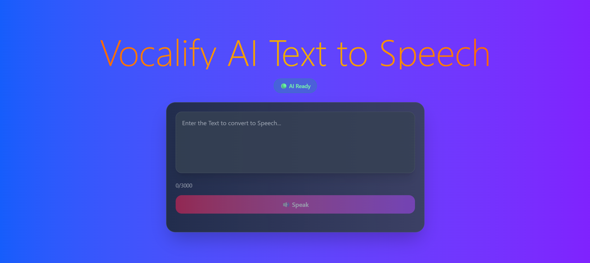

# 🔊 Vocalify AI - Text to Speech Converter

A modern, responsive web application that converts text to speech using AI-powered voice synthesis. Built with React and styled with Tailwind CSS, featuring a beautiful gradient interface and real-time audio controls.

## ✨ Features

- 🎯 **Real-time Text-to-Speech Conversion** - Convert up to 3000 characters instantly
- 🎨 **Modern UI/UX** - Beautiful gradient design with glassmorphism effects
- 🔄 **Live Audio Controls** - Play, pause, and stop audio playback
- 📱 **Fully Responsive** - Works seamlessly on desktop, tablet, and mobile
- ⚡ **Real-time Status** - Visual indicator for AI service availability
- 🎛️ **Character Counter** - Live character count with limit visualization
- 🛡️ **Error Handling** - Comprehensive error messages and validation
- 🌟 **Smooth Animations** - Elegant hover effects and transitions

## 📸 Screenshots



## 🛠️ Tech Stack

- **Frontend Framework:** React 18
- **Styling:** Tailwind CSS
- **Text-to-Speech:** Puter AI API
- **Build Tool:** Vite
- **Language:** JavaScript/JSX

## 📋 Prerequisites

- Node.js (v16 or higher)
- npm or yarn package manager
- Access to Puter AI platform

## ⚙️ Installation

1. **Clone the repository**
   ```bash
   git clone https://github.com/yourusername/vocalify-ai.git
   cd vocalify-ai
   ```

2. **Install dependencies**
   ```bash
   npm install
   # or
   yarn install
   ```

3. **Start the development server**
   ```bash
   npm run dev
   # or
   yarn dev
   ```

4. **Open your browser**
   Navigate to `http://localhost:5173`

## 🏗️ Project Structure

```
vocalify-ai/
├── public/
│   └── index.html
├── src/
│   ├── components/
│   │   └── App.jsx
│   ├── styles/
│   │   └── index.css
│   └── main.jsx
├── screenshots/
│   ├── main-interface.png
│   ├── speaking-state.png
│   └── mobile-view.png
├── package.json
├── tailwind.config.js
├── vite.config.js
└── README.md
